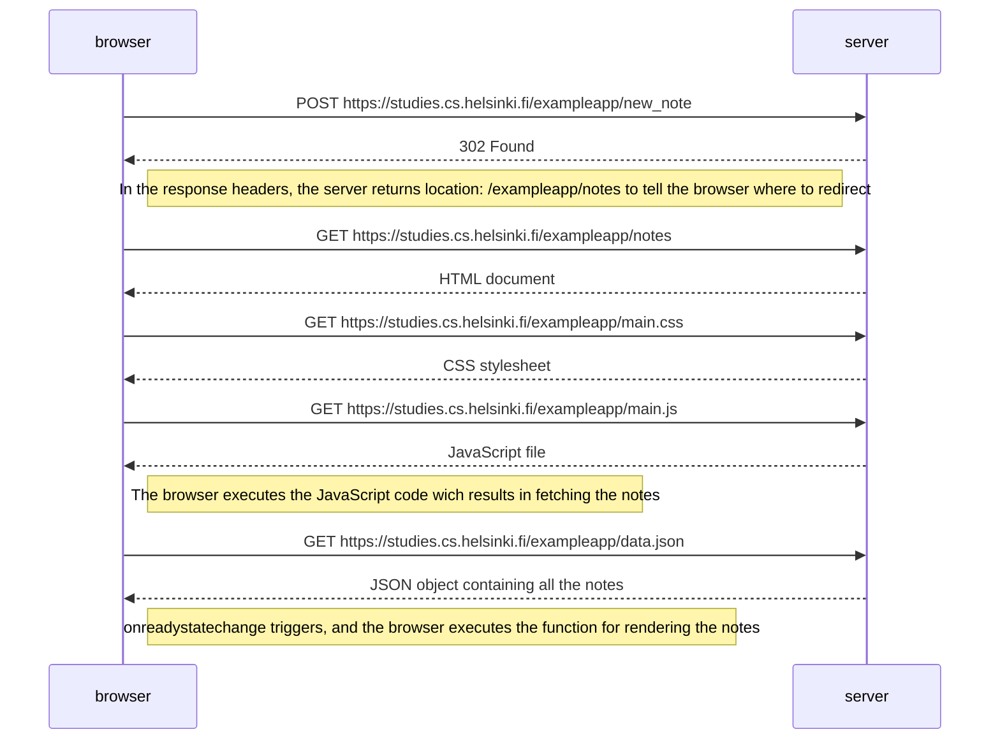

```mermaid
sequenceDiagram
    participant browser
    participant server

    browser->>server: POST https://studies.cs.helsinki.fi/exampleapp/new_note
    server-->>browser: 302 Found

    note left of server: In the response headers, the server returns location: /exampleapp/notes to tell the browser where to redirect

    browser->>server: GET https://studies.cs.helsinki.fi/exampleapp/notes
    server-->>browser: HTML document

    browser->>server: GET https://studies.cs.helsinki.fi/exampleapp/main.css
    server-->>browser: CSS stylesheet

    browser->>server: GET https://studies.cs.helsinki.fi/exampleapp/main.js
    server-->>browser: JavaScript file

    note right of browser: The browser executes the JavaScript code wich results in fetching the notes

    browser->>server: GET https://studies.cs.helsinki.fi/exampleapp/data.json
    server-->>browser: JSON object containing all the notes

    note right of browser: onreadystatechange triggers, and the browser executes the function for rendering the notes
```