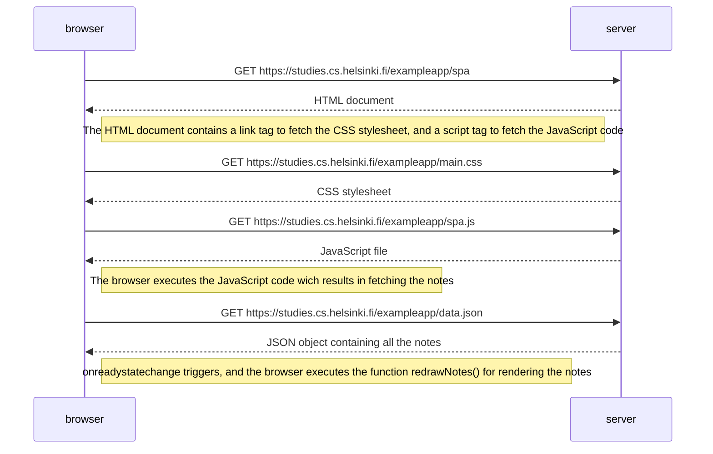

```mermaid
sequenceDiagram
    participant browser
    participant server

    browser->>server: GET https://studies.cs.helsinki.fi/exampleapp/spa
    server-->>browser: HTML document

    note right of browser: The HTML document contains a link tag to fetch the CSS stylesheet, and a script tag to fetch the JavaScript code

    browser->>server: GET https://studies.cs.helsinki.fi/exampleapp/main.css
    server-->>browser: CSS stylesheet

    browser->>server: GET https://studies.cs.helsinki.fi/exampleapp/spa.js
    server-->>browser: JavaScript file

    note right of browser: The browser executes the JavaScript code wich results in fetching the notes

    browser->>server: GET https://studies.cs.helsinki.fi/exampleapp/data.json
    server-->>browser: JSON object containing all the notes

    note right of browser: onreadystatechange triggers, and the browser executes the function redrawNotes() for rendering the notes
```