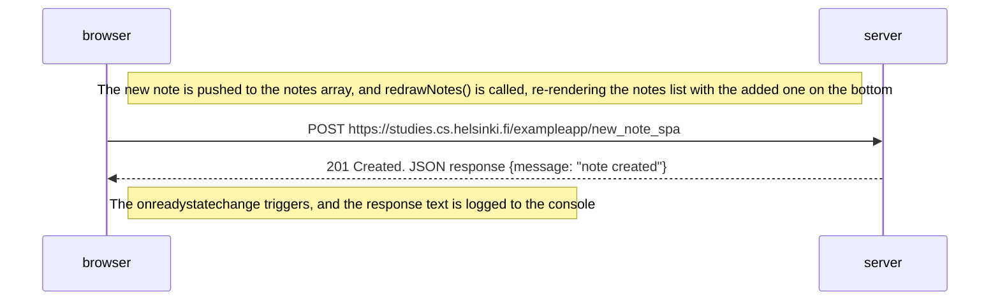

```mermaid
sequenceDiagram
    participant browser
    participant server

    note right of browser: The new note is pushed to the notes array, and redrawNotes() is called, re-rendering the notes list with the added one on the bottom
    
    browser->>server: POST https://studies.cs.helsinki.fi/exampleapp/new_note_spa
    server-->>browser: 201 Created. JSON response {message: "note created"}

    note right of browser: The onreadystatechange triggers, and the response text is logged to the console
```